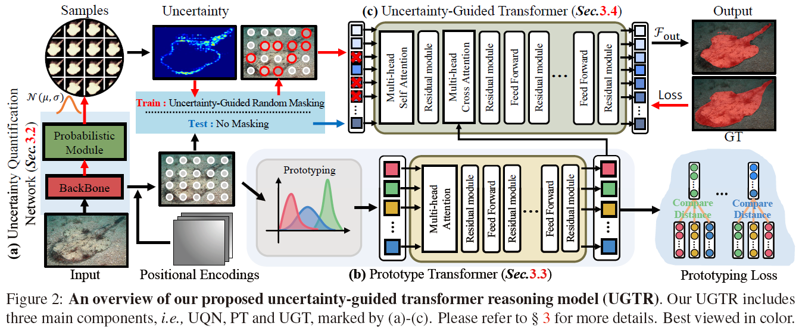
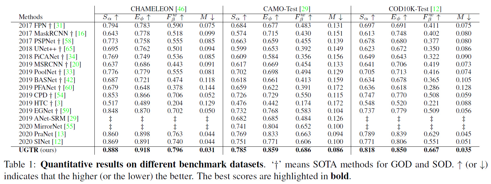
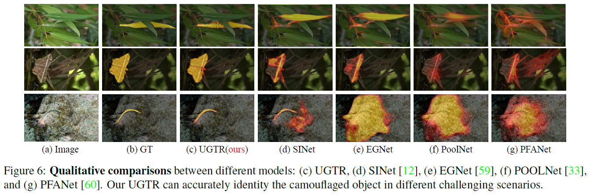

# Uncertainty-Guided Transformer Reasoning for Camouflaged Object Detection (ICCV2021)

> Authors:
> [Fan Yang](https://scholar.google.com/citations?user=FSfSgwQAAAAJ&hl=en), 
> [Qiang Zhai](https://github.com/cvqiang/mgl), 
> [Xin Li](https://scholar.google.com/citations?user=TK-hRO8AAAAJ&hl=en), 
> Rui Huang, 
> [Hong Cheng](https://scholar.google.com/citations?user=-845MAcAAAAJ&hl=zh-CN), 
> [Deng-Ping Fan](https://dpfan.net/).



1. Configuring your environment (Prerequisites):

    Pytorch>=1.0.0
    
    OpenCV
    
<!--2. Downloading Testing Sets: -->
2. Downloading Testing Sets:
    + downloading _**NEW testing dataset**_ (COD10K-test + CAMO-test + CHAMELEON), which can be found in this [Google Drive link](https://drive.google.com/file/d/1QEGnP9O7HbN_2tH999O3HRIsErIVYalx/view?usp=sharing) or [Baidu Pan link](https://pan.baidu.com/s/143yHFLAabMBT7wgXA0LrMg) with the fetch code: z83z.

3. Testing Configuration:

    + After you download the trained models [Google Drive link](https://drive.google.com/file/d/1RFdqvzMZMzi6VdVl_8-sMgWT0Os-E9tE/view?usp=sharing) or [Baidu Pan link](https://pan.baidu.com/s/16WRL_J6C7_Wq4d1spgfj5g?pwd=9f0u), move it into './model_file/'.
    + Assigning your comstomed path in 'config/cod_resnet50.yaml', like 'data_root', 'test_list'.
    + Playing 'test.py' to generate the final prediction map, the predicted camouflaged object region and cmouflaged object edge is saved into 'result' as default.
    
5. Evaluation your trained model:

    + One-key evaluation is written in MATLAB code (revised from [link](https://github.com/DengPingFan/CODToolbox)), 
    please follow this the instructions in `main.m` and just run it to generate the evaluation results in 
    `./EvaluationTool/EvaluationResults/Result-CamObjDet/`.
    + The results can be downloaded in [Baidu Pan link](https://pan.baidu.com/s/1gA-Rf9oqQK8vfXamemSxlw?pwd=2kj3)(password: 2kj3).




    
6. Training Configuration:
   + After you download the initial model [Google Drive link](https://drive.google.com/file/d/17WYyKg40DkAgFWOusiAKgqZOlfUFzjn5/view?usp=sharing) or [Baidu Pan link](https://pan.baidu.com/s/1BqNRkCWxgvVd7-uGh8IN1Q?pwd=heb7), move it to './pre_trained/'.
   + Put the 'train_test_file/train.lst' to the path which is included in cod_resnet50.yaml.
   + Run train.py

6. If you think this work is helpful, please cite

```
@inproceedings{fan2021ugtr,
  title={Uncertainty-Guided Transformer Reasoning for Camouflaged Object Detection},
  author={Yang, Fan and Zhai, Qiang and Li, Xin and Huang, Rui and Cheng, Hong and Fan, Deng-Ping},
  booktitle={IEEE International Conference on Computer Vision(ICCV)},
  pages={},
  year={2021}
}
```
